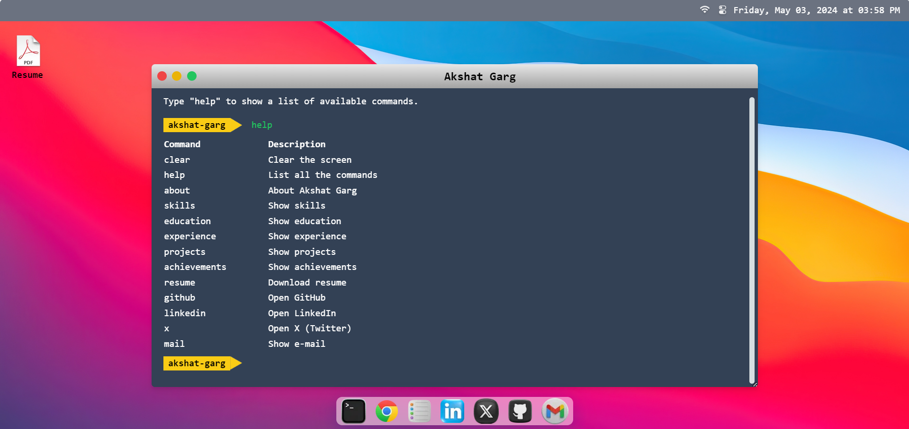
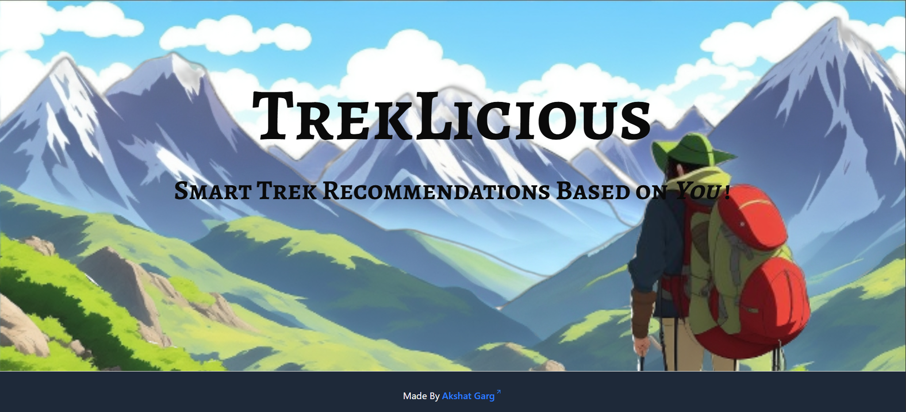

<h1 align="center">
<a rel="noopener noreferrer" target="_blank" href="https://akshat-garg.com">
akshat-garg
</a>
</h1>

   &nbsp; &nbsp;

   &nbsp; &nbsp;

   &nbsp; &nbsp;

This is a monorepo (Turborepo) containing all my projects and portfolios.

### My Projects:

1. [MacOS Portfolio](./apps/macos-portfolio/README.md) :
   A portfolio based on MacOS Terminal UI, where user puts in different commands to get desired information about me.
   

      <a rel="noopener noreferrer" target="_blank" href="https://akshat-garg.com">
      (Live Link)
      </a>
   

   

2. [ThreeJS Portfolio](./apps/threejs-portfolio/README.md) :
   A portfolio built using ThreeJS library with 3D Model and animation.
   

      <a rel="noopener noreferrer" target="_blank" href="https://threejs-portfolio.akshat-garg.com">
      (Live Link)
      </a>
   

   

3. [TrekLicious](./apps/treklicious-fe/README.md) :
   A full stack application built for trek lovers built using MERN.
   

      <a rel="noopener noreferrer" target="_blank" href="https://treklicious.akshat-garg.com/?ref=rec">
      (Live Link)
      </a>
   

   

3. [RatVenture](./apps/ratventure-fe/README.md) :
   Visualization of Rat In A Maze Problem.
   

      <a rel="noopener noreferrer" target="_blank" href="https://ratventure.akshat-garg.com/?ref=rec">
      (Live Link)
      </a>
   

   
