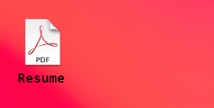
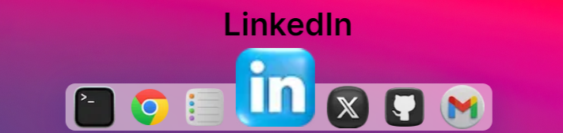
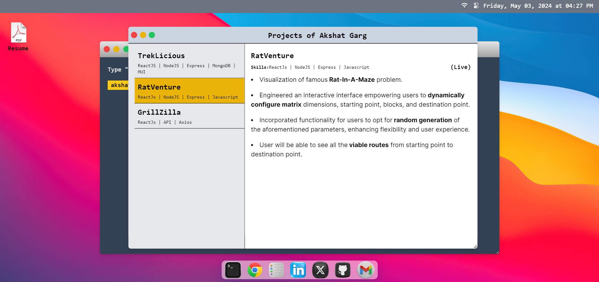

<h1 align="center">
<a rel="noopener noreferrer" target="_blank" href="https://akshat-garg.com">
MacOS Portfolio
</a>
</h1>

 A portfolio based on MacOS Terminal UI, where user puts in different commands to get desired information about me.

### Features:

- A Lock Screen where user puts his name to Sign In.
  

- User can enter various commands in terminal to get desired output.
  

- There's a Resume icon on home screen for user to download my resume directly. 
  

- There's a responsive footer as well. Different Icons perform different sections.
  

- From Notes App Icon, user can open an interface showing all of my projects.
  

- There's a dynamic clock at top left corner of screen. 
  
