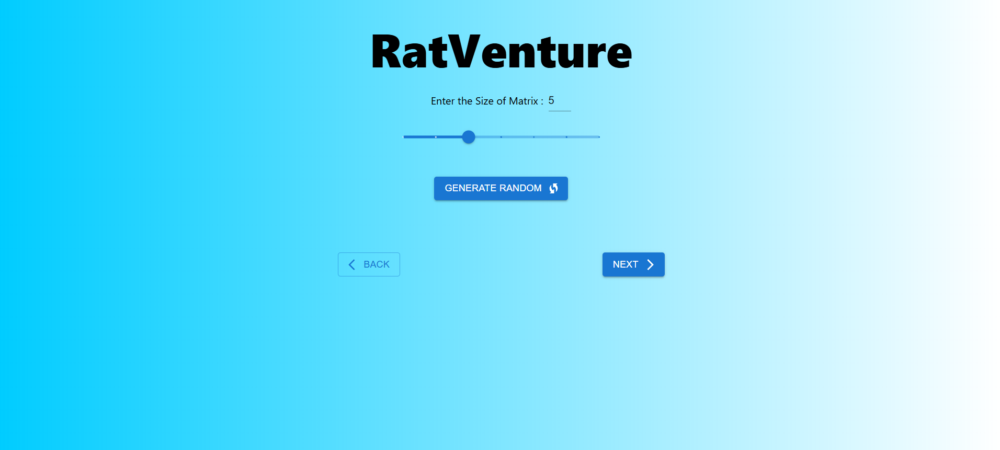
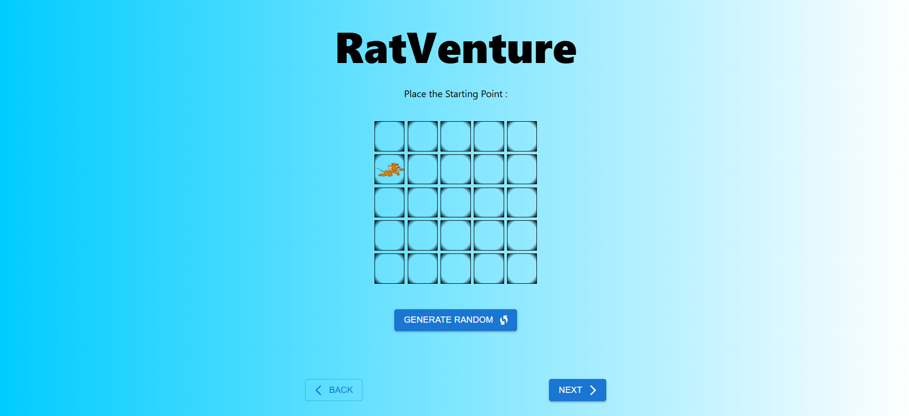
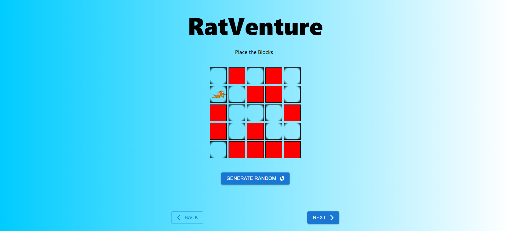
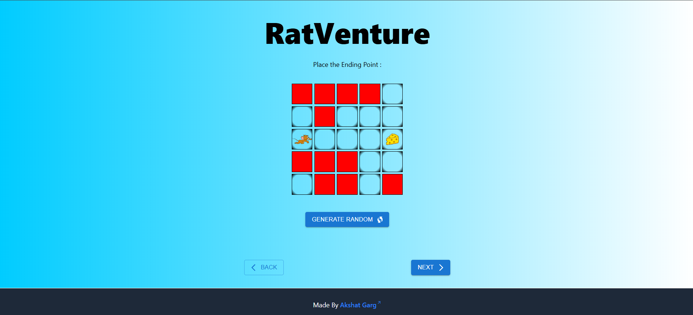
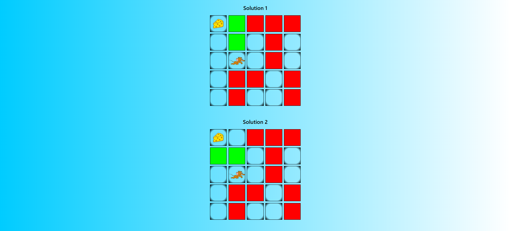

<h1 align="center">
<a rel="noopener noreferrer" target="_blank" href="https://ratventure.akshat-garg.com/?ref=rec">
RatVenture
</a>
</h1>

 Visualization of Rat In A Maze Problem. This is frontend code, backend code is available <a href="../ratventure-be/README.md">here</a>.

### Tech Used:

- Vite v6
- React v19
- Tailwind v4
- React Router v7

### Features:

- Set the size of matrix. 
  

- Set the starting point. 
  

- Set the blocks. 
  

- Set the ending point. 
  

- User can randomly generate above parameters. 
  

- After setting all parameters, the user can see the result(s). 
  
