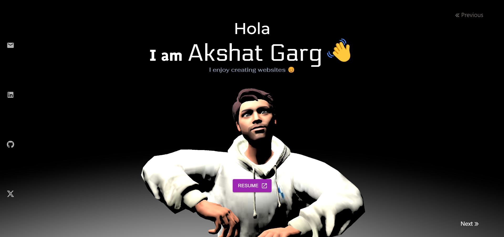
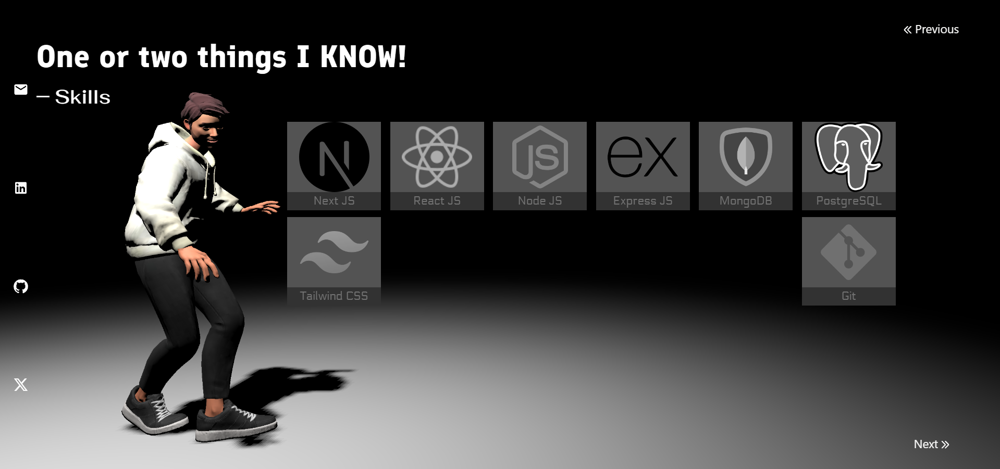
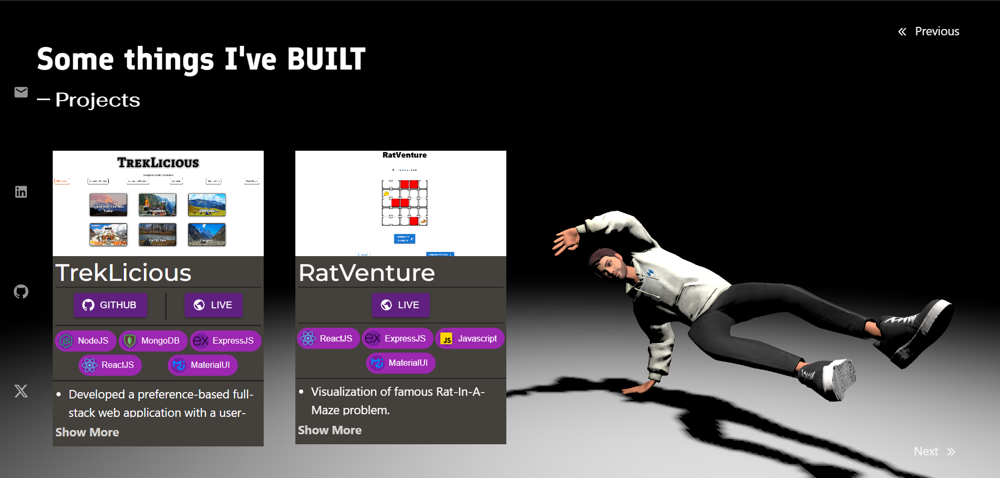
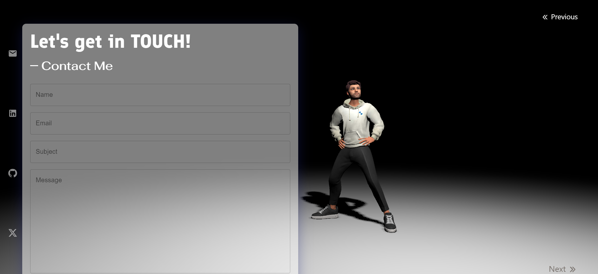

<h1 align="center">
<a rel="noopener noreferrer" target="_blank" href="https://threejs-portfolio.akshat-garg.com">
ThreeJS Portfolio
</a>
</h1>

A portfolio built using ThreeJS library with 3D Model and animation.

### Features:

- Landing Screen with Resume Button and left sidebar to quickly access my resume and my socials respectively. 
  

- Previous and Next Buttons to got through different sections of portfolio. Ex: Skills Section. 
  

- On transition between sections, the 3D Model performs a continuous animation. Ex: Projects Section 
  

- This portfolio has a contact form as well. 
  
