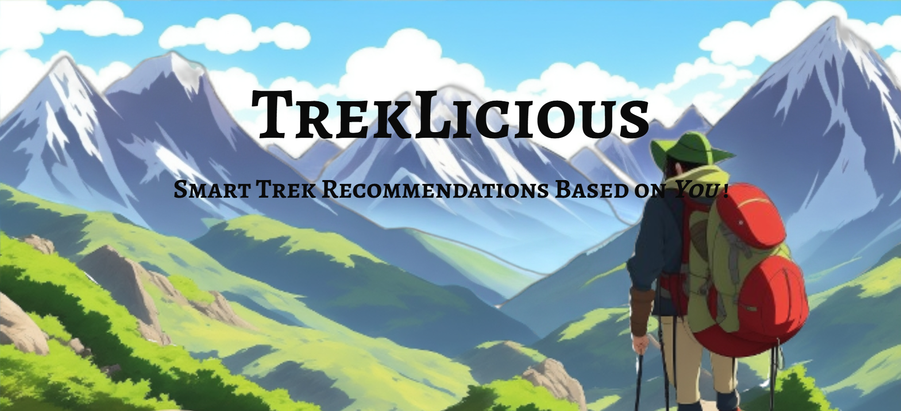

<h1 align="center">
<a rel="noopener noreferrer" target="_blank" href="https://treklicious.akshat-garg.com/?ref=rec">
TrekLicious
</a>
</h1>

 A full stack application built for trek lovers built using MERN. This is frontend code, backend code is available <a href="../treklicious-be/README.md">here</a>.

### Tech Used:

- Vite v6
- React v19
- Tailwind v4
- React Router v7
- Tanstack Query v5

### Features:

- Landing page with parallax scrolling, implemented using framer-motion. 
  

- Created common components and used best practices of React. 
  

- Sign Up and Log In functionality is integrated using industry standard JWT method. 
  

- User can set his preferences. 
  

- A comprehensive dashboard for user to show treks. 
  

- Trek page to show details of treks. 
  

- User can add/remove treks to his favorite list. 
  
